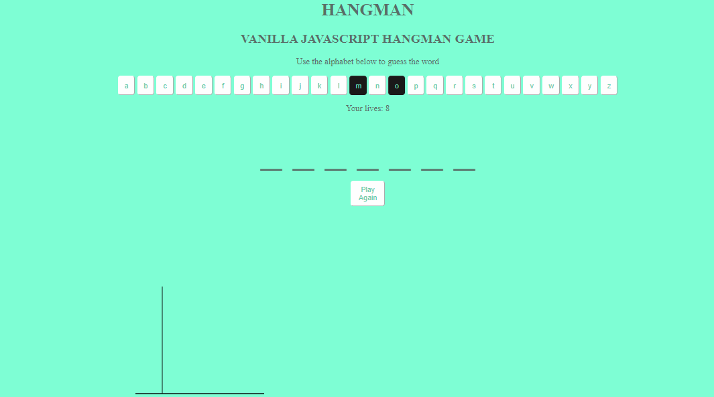

#Hangman game

The project is based on the principle of fetching a random word from the https://random-word-api.herokuapp.com/word?number=1 API. It is built using Vanilla JS and CSS.

You can reach to live project : https://feyizoglu.github.io/hangman-game/

